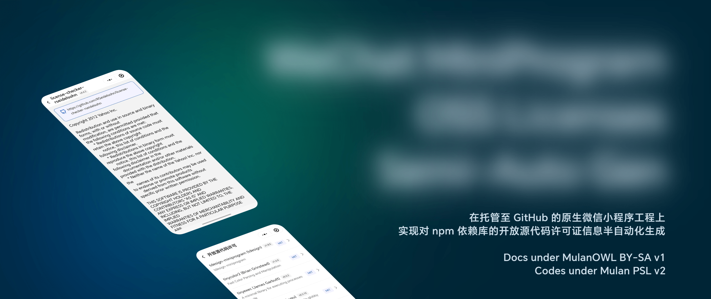

# WeChat MiniProgram OSS Licenses Semi-Auto Gen

在托管至 GitHub 的原生微信小程序工程上实现对 npm 依赖库的开放源代码许可证信息半自动化生成



<div align="center">

[](https://sourcery.ai)

</div>

<details>

<summary>效果示例</summary>


</details>

## 前言

此仓库所有文档采用[木兰开放作品许可协议 署名-相同方式共享，第1版](LICENSE-docs)许可，代码采用[木兰宽松许可证, 第2版](LICENSE)许可。

如果您的微信小程序工程非原生微信小程序工程（如 Uni-App、Taro 等跨平台工程，或 Vite、Webpack、Rollup 等构建工具工程），请优先考虑使用诸如 [rollup-license-plugin](https://github.com/codepunkt/rollup-license-plugin)、[webpack-license-plugin](https://github.com/codepunkt/webpack-license-plugin) 等插件。此仓库所列举的方案只能实现半自动化生成开放源代码许可证信息，而使用 Vite、Webpack、Rollup 等构建工具及其插件可实现全自动编译产物构建。

## 依赖需求

首先需确保本地存在 Node.js 和 npm 环境。若还未安装，请前往 [Node.js](https://nodejs.org/zh-cn/download/) 官网按指导进行安装，这里不再赘述。下文假定您已安装 Node.js 和 npm。

在原生微信小程序工程根目录（即微信小程序 `project.config.json` 所在目录）中打开终端，安装 `license-checker-rseidelsohn`、`shelljs`、`uglify-js` 和 `json5` 依赖

> npm

```sh
npm install license-checker-rseidelsohn shelljs uglify-js json5 --save-dev
```

> Yarn

```sh
yarn add license-checker-rseidelsohn shelljs uglify-js json5 --dev
```

> pnpm

```sh
pnpm add license-checker-rseidelsohn shelljs uglify-js json5 --dev
```

## 快速开始

### 1. 配置许可证构建脚本

将 [`OSSLicensesBuilder.js`](source-code/OSSLicensesBuilder.js)、[`OSSLicensesBuilderConfig.json5`](source-code/OSSLicensesBuilderConfig.json5) 和 [`OSSLicensesBuildFormat.json`](source-code/OSSLicensesBuildFormat.json) 文件下载并移动至微信小程序工程根目录（即微信小程序 `project.config.json` 所在目录），并执行命令：

```sh
npm pkg set scripts.build-oss-licenses-dist="node OSSLicensesBuilder.js"
```

或直接在根目录 `package.json` 新增：

```json
{
  "scripts": {
    "build-oss-licenses-dist": "node OSSLicensesBuilder.js"
  }
}
```

<details>

<summary>

`package.json` 完整示例

</summary>

```json
{
  "dependencies": {},
  "devDependencies": {
    "license-checker-rseidelsohn": "^4.4.2",
    "json5": "^2.2.3",
    "shelljs": "^0.8.5",
    "uglify-js": "^3.19.3"
  }, 
  "scripts": {
    "build-oss-licenses-dist": "node OSSLicensesBuilder.js"
  }
}
```

</details>

此时执行

```sh
npm run build-oss-licenses-dist
```

命令，则会在微信小程序工程根目录生成 `OSSLicensesDist.js` 和 `OSSLicensesDistText.js` 文件。开放源代码许可信息由 `module.exports` 语句导出为 JS 对象。

为缩减文件大小，防止文件内存在过多重复的许可证文本，脚本将生成两个文件：
- `OSSLicensesDist.js`：包含所有依赖项许可证信息的 JavaScript 文件
- `OSSLicensesDistText.js`：包含所有许可证文本的 JavaScript 文件

`OSSLicensesDist.js` 中的子项将存在 `licenseTextHash` 字段，该字段的值为许可证文本的 SHA256 杂凑值，可在 `OSSLicensesDistText.js` 中作为键找到。

如果您希望将 `OSSLicensesDist.js` 文件放在具体 Page 页或其他自定义目录，请在 `OSSLicensesBuilderConfig.json5` 文件中修改 `customPath` 属性，如：

```json5
[
  {
    outputFile: "OSSLicensesDist",
    customFormat: "OSSLicensesBuildFormat.json",
    customPath: "/this-is-my-goal-page/my-assets/",
  }
]
```

如果您的微信小程序使用了分包，并由于分包而在多个子包存在 npm 依赖项，希望一并生成子包的开放源代码许可信息，则可在 `OSSLicensesBuilderConfig.json5` 文件中新增配置，如：

```json5
[
  {
    outputFile: "OSSLicensesDist",
    customFormat: "OSSLicensesBuildFormat.json",
    customPath: "/"
  },
  {
    outputFile: "OSSLicensesDistSub1",
    customFormat: "OSSLicensesBuildFormat.json",
    customPath: "/",
    startPath: "subpackage1/"
  },
  {
    outputFile: "OSSLicensesDistSub2",
    customFormat: "OSSLicensesBuildFormat.json",
    customPath: "/",
    startPath: "subpackage2/"
  }
]
```

此时执行 `npm run build-oss-licenses-dist` 命令，则会在微信小程序工程根目录生成 `OSSLicensesDist.js`、`OSSLicensesDistText.js`、`OSSLicensesDistSub1.js`、`OSSLicensesDistSub1Text.js`、`OSSLicensesDistSub2.js` 和 `OSSLicensesDistSub2Text.js` 文件。可按需使用。

<details>

<summary>可选：OSSLicensesBuildFormat.json 配置</summary>

`OSSLicensesBuildFormat.json` 用于自定义 `license-checker-rseidelsohn` 对生成的开放源代码信息文件的构建格式，如仓库示例：

```json
{
  "name": "",
  "repository": "",
  "publisher": "",
  "email":"",
  "version": "",
  "description": "",
  "licenses": "",
  "licenseText": "",
  "path": false,
  "licenseFile": false,
  "copyright": false
}
```

若属性设置为 `false`，则不会在生成的开放源代码信息文件中生成该属性。若非 `false`，则填入值为占位默认值。

举例来说，假设为 `"email"` 属性填入值为 `"異議あり！"` 如果 `license-checker-rseidelsohn` 未在某个 npm 依赖包中找到此包作者的 `email` 信息，则会对生成的开放源代码信息文件中的此项包的 `email` 属性值设置为 `"異議あり！"`。

有效属性为：

- `copyright`：版权声明信息，如 “Copyright (c) 年份 作者名 作者连接”
- `description`：描述
- `email`：邮箱
- `licenseFile`：此依赖项在本地计算机中的开源许可文件所在的本地路径字符串。由于对用户端来说本地路径没有什么实质作用，且考虑到微信小程序文件总大小限制，不建议生成此项。
- `path`：同上，不建议生成此项。
- `licenseModified`
- `licenses`：开源许可名称
- `licenseText`：开源许可全文。为缩减文件大小，防止文件内存在过多重复的许可证文本，脚本会将此字段改为 `licenseTextHash` 字段，该字段的值为许可证文本的 SHA256 杂凑值，可在 `OSSLicensesDistText.js` 中作为键找到。
- `name`：依赖项名称
- `publisher`：依赖项发布者
- `repository`：开源仓库地址
- `url`：依赖项地址，大多数情况下此项为空
- `version`：依赖项的语义版本号

</details>

### 2. 配置 GitHub Actions 工作流

在 GitHub 仓库根目录新建 `.github` 目录，打开 `.github` 目录后，新增 `workflows` 目录。

将 [`update-oss-licenses-dist.yml`](/source-code/update-oss-licenses-dist.yml) 下载并移动至 `.github/workflows` 目录。

下载的 `update-oss-licenses-dist.yml` 默认采用 `windows-latest` 为工作流运行环境：

```yaml
jobs:
  update-oss-licenses-dist:
    strategy:
      matrix:
        os: [ windows-latest ] # 请根据您的微信小程序开发环境配置相应（如 `macos-latest`、`ubuntu-latest` 等），因为部分 npm 包在不同系统环境下分发的包不一致
    runs-on: ${{ matrix.os }}
```

由于部分 npm 包在不同系统环境下分发的包不一致，请根据您的实际情况修改 `update-oss-licenses-dist.yml` 文件。例如：

- 如果您的微信小程序使用 [`miniprogram-ci`](https://developers.weixin.qq.com/miniprogram/dev/devtools/ci.html) 构建，请根据构建服务器选择运行环境。例如假设 `miniprogram-ci` 在 Linux 系统下工作，请将 `matrix`.`os` 改为 `ubuntu-latest`。
- 如果您在 Windows 上使用微信开发者工具构建与上传，请将 `matrix`.`os` 改为 `windows-latest`。
- 如果您在 macOS 上使用微信开发者工具构建与上传，请将 `matrix`.`os` 改为 `macos-latest`。

将包含 `.github/workflows/update-oss-licenses-dist.yml` 的提交推送至 GitHub 仓库后，默认情况下，此工作流会自动在每次提交后运行。如果工作流内生成的开源许可信息文件与仓库原有的开源许可信息文件不一致，则此工作流会将新的开放源代码许可信息文件生成一个 Pull Request。

### 3. 在微信小程序中使用并展示开源许可信息

由于生成的开源许可信息 JavaScript 文件已经由 `module.exports` 导出为 JS 对象，因此您可以在微信小程序中直接引用此文件。例如：

```JavaScript
// 假设这是 pages/oss-licenses-menu/oss-licenses-menu.js

// 如果存在分包，需要多次引入相关对象，这里不再赘述
const ossLicensesDist = require('../../OSSLicensesDist.js')

// 以 `Page()` 页面构造器为例
Page({
    data: {},
    onLoad(options) {
        console.log(ossLicensesDist)

        // 由对应页面 WXML 属性绑定此数据并向用户端展示信息
        this.setData({
            ossLicensesDist: ossLicensesDist
        })
    }, licenseDistClick(e) {
        // 点击开源许可信息项，跳转到对应开源许可信息页面。对应开源许可信息页面的具体写法此文档不再赘述。
        wx.navigateTo({
            url: '/pages/oss-licenses/oss-licenses?index=' + e.currentTarget.dataset.index,
        })
        // **提醒**：
        // 如需展示许可证全文文本，请在常量 `ossLicensesDist` 找到该项的 `licenseTextHash` 字段的值，
        // 然后引入 `OSSLicensesDistText.js`，
        // 将上述 `licenseTextHash` 的值作为键在 `OSSLicensesDistText.js` 中找到此键的值，值即为许可证文本。
    }
})
```

```html
<!-- 假设这是 pages/oss-licenses-menu/oss-licenses-menu.wxml -->
<!-- 假设项目引入了 TDesign 微信小程序组件库，并引入了其中的 `t-cell` 和 `t-tag` 组件 -->
<!-- 为方便展示样式表，这里假设项目引入了 UnoCSS。具体样式声明可在下列元素的 class 中查看 -->

<t-cell arrow bind:tap="licenseDistClick" data-index="{{index}}" description="{{item.description}}" hover
        wx:for="{{ossLicensesDist}}" wx:key="index">
    <view slot="title">
        <text class="text-32rpx inline">{{item.name + (item.publisher !== '' ? (' (' + item.publisher + ')') : '')}}</text>
        
        <!-- 依赖项语义版本号。展示版本号以防止因部分依赖项在项目迭代过程存在开源许可变更导致的同项目许可混淆 -->
        <t-tag class="ml-16rpx inline-block vertical-bottom" size="small" theme="default" variant="light">
            {{'v' + item.version}}
        </t-tag>
    </view>
    
    <!-- 依赖项开源许可名称 -->
    <t-tag class="ml-16rpx" size="medium" slot="note" theme="primary" variant="light">
        {{item.licenses}}
    </t-tag>
</t-cell>
```

## 开源相关

此仓库的诞生离不开以下开源项目，感谢以下开源项目的作者和贡献者：

- [NPM License Checker（Roman Seidelsohn）](https://github.com/RSeidelsohn/license-checker-rseidelsohn)，Licensed under [BSD 3-Clause License](https://github.com/RSeidelsohn/license-checker-rseidelsohn/blob/master/LICENSE)
- [ShellJS](https://github.com/shelljs/shelljs)，Licensed under [BSD 3-Clause License](https://github.com/shelljs/shelljs/blob/master/LICENSE)
- [UglifyJS](https://github.com/mishoo/UglifyJS)，Licensed under [BSD License](https://github.com/mishoo/UglifyJS/blob/master/LICENSE)
- [JSON5](https://json5.org/)，Licensed under [MIT License](https://json5.org/LICENSE.md)
- [TDesign WeChat MiniProgram（Tencent）](https://github.com/Tencent/tdesign-miniprogram)，Licensed under [MIT License](https://github.com/Tencent/tdesign-miniprogram/blob/develop/LICENSE)
- [Node.js®（OpenJS Foundation）](https://nodejs.org/)，Licensed under [MIT License](https://github.com/nodejs/node/blob/main/LICENSE)
- [npm](https://www.npmjs.com/)，Licensed under [Artistic License 2.0](https://github.com/npm/cli/blob/latest/LICENSE)
- [UnoCSS](https://unocss.dev/)，Licensed under [MIT License](https://github.com/unocss/unocss/blob/main/LICENSE)
